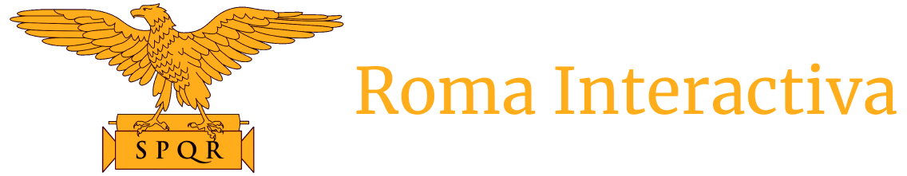

# Roma Interactiva

  

#
Explora la Antigua Roma de manera innovadora.

¡Bienvenido a Roma Interactiva! Nuestro objetivo es hacer que el fascinante mundo de la Antigua Roma sea accesible para todas las personas de una manera interactiva e innovadora.

Ya sea que estés interesado en la arquitectura romana, las leyendas y mitología, las estrategias militares o la política de la época, Roma Interactiva te ofrece una experiencia completa y enriquecedora. A través de nuestra plataforma, podrás acceder a contenido de alta calidad, actividades interactivas, recreaciones 3D, mapas interactivos y mucho más.

## Acceso a la aplicación

Puedes ver la aplicación en la siguiente URL: [Web Roma Interactiva](https://roma-front-gxm7zdrgd-grupo-desarrollo-de-sofware.vercel.app/)

## Instalación y Ejecución

### Backend

1. Navega hasta la carpeta `backend` en tu terminal.
2. Ejecuta el siguiente comando para instalar las dependencias del backend:
   `npm install`
3. Ejecuta el siguiente comando para iniciar el servidor:
   `node server.js`

### Frontend

1. Navega hasta la carpeta `frontend` en tu terminal.
2. Ejecuta el siguiente comando para instalar las dependencias del frontend:
   `npm install`
3. Ejecuta el siguiente comando para iniciar la aplicación frontend:
   `npm start`
